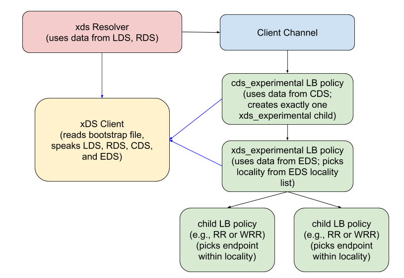

> 原文：[proposal/A27-xds-global-load-balancing.md at master · grpc/proposal · GitHub](https://github.com/grpc/proposal/blob/master/A27-xds-global-load-balancing.md)


* Author(s): Mark D. Roth
* Approver: a11r
* Status: Implemented
* Implemented in: C-core, Java, and Go
* Last updated: 2020-03-18
* Discussion at: https://groups.google.com/d/topic/grpc-io/GWIH4XhIqHA/discussion

## 摘要

gRPC 目前支持自己的 "grpclb " 协议，用于旁观（look-aside）负载平衡。然而，流行的 Envoy 代理使用 xDS API 进行许多类型的配置，包括负载平衡，而且该API正在演变成一种标准，将用于配置各种数据平面软件。为了与这个行业趋势接轨，gRPC 将从原来的 grpclb 协议转向新的 xDS 协议。

xDS 协议允许配置各种功能，包括许多 gRPC 目前不支持的功能。随着时间的推移，我们将在 gRPC 中慢慢增加对更多这些功能的支持。我们将为每一组 xDS 功能发布一个 gRFC，因为我们增加了对它们的支持。

本文档描述了我们为支持全局负载平衡功能所做的改变，这也是我们最初针对的 xDS 功能集。这只影响到 gRPC 客户端；xDS 在 gRPC 服务器中的使用将在以后作为一套单独的 xDS 功能的一部分出现。

## 背景

xDS API 实际上是一套 API，其名称为 "x Discovery Service"，其中有许多 "x "的值（因此整个协议套件被称为 "xDS"）。目前还没有关于该协议的正式规范，但最好的参考是在 https://www.envoyproxy.io/docs/envoy/latest/api-docs/xds_protocol。本文档的读者在继续阅读之前应该熟悉 xDS 的API。

xDS 的 API 本质上是 pub/sub 机制，每个 API 允许订阅不同类型的配置资源。在 xDS 的 API 流程中，客户使用以下主要的 API，按照这个顺序：

- __Listener Discovery Service (LDS)__: 返回 [`Listener`](https://github.com/envoyproxy/envoy/blob/9e83625b16851cdc7e4b0a4483b0ce07c33ba76b/api/envoy/api/v2/listener.proto#L27) 资源。基本上是作为 gRPC 客户端配置的一个方便的根（root）。指向RouteConfiguration。
- __Route Discovery Service (RDS)__: 返回 [`RouteConfiguration`](https://github.com/envoyproxy/envoy/blob/9e83625b16851cdc7e4b0a4483b0ce07c33ba76b/api/envoy/api/v2/route.proto#L24) 资源。提供用于填充 gRPC [service config](https://github.com/grpc/grpc/blob/master/doc/service_config.md) 的数据。指向集群 (Cluster)。
- __Cluster Discovery Service (CDS)__: 返回 [`Cluster`](https://github.com/envoyproxy/envoy/blob/9e83625b16851cdc7e4b0a4483b0ce07c33ba76b/api/envoy/api/v2/cluster.proto#L34) 资源。配置诸如负载平衡策略和负载报告的内容。指向ClusterLoadAssignment。
- __Endpoint Discovery Service (EDS)__: 返回 [`ClusterLoadAssignment`](https://github.com/envoyproxy/envoy/blob/9e83625b16851cdc7e4b0a4483b0ce07c33ba76b/api/envoy/api/v2/endpoint.proto#L33) 资源。配置负载平衡的端点（后端服务器）集合，并可能告诉客户端放弃请求。

 gRPC将支持 xDS 的聚合发现服务（Aggregate Discovery Service / ADS）变体，其中所有这些资源类型都是在一个gRPC流上获得的。然而，API 流的不同阶段仍通常使用上述单独的服务名称来提及。

在未来，我们可能会增加对 xDS 的 增量 ADS 变体的支持。然而，我们没有计划支持 xDS 的任何非聚合变体，也没有计划支持 REST 或文件系统订阅。

最初，gRPC将支持版本2的 xDS APIs。在未来，我们可能会升级到 v3 或更高版本，并有适当的过渡期，以使用户能够升级他们的管理服务器。


### 相关提案

[A24: Load Balancing Policy Configuration](https://github.com/grpc/proposal/blob/master/A24-lb-policy-config.md)

## 提案

### gRPC 客户端架构

因为 xDS 不仅处理负载均衡，而且还处理服务发现和配置，gRPC 将通过解析器和 LB 策略插件支持 xDS。解析器和 LB 策略插件都需要与 xDS 服务器通信，因此与 xDS 服务器交互的功能将包含在一个 XdsClient 对象中，解析器和 LB 策略都将使用该对象。

将有两个用于 xDS  的独立 LB 策略，一个是支持 Cluster 数据，另一个是支持 ClusterLoadAssignment 数据。

请注意，目前 LB 策略的名称将有 "experimental" 的后缀。当功能被证明是稳定的，这些后缀将被删除。



[Link to SVG file](A27_graphics/grpc_client_architecture.svg)

#### XdsClient and Bootstrap File

XdsClient 对象包含与 xDS 服务器交互的所有逻辑。XdsClient 对象是一个纯粹的内部 API，不是暴露给 gRPC 用户的东西，但它在这里被描述为用于在 gRPC 客户端支持 xDS 的架构的一部分。

XdsClient 对象是通过 bootstrap 文件配置的。引导文件的位置是通过 GRPC_XDS_BOOTSTRAP 环境变量决定的。该文件是 JSON 格式的，其内容看起来像这样：

```json
{
  // 要与之对话的xDS服务器。 
  // 该值是一个数组，以允许未来的变化，以增加支持在主服务器故障时故障转移到一个辅助的xDS服务器，
  // 但现在，只有数组中的第一个条目将被使用。
  "xds_servers": [
    {
      "server_uri": <string containing URI of xds server>,
      // 频道证书的列表；
      // 客户端将在其支持的第一个类型上停止。 
      // 这个字段是必需的，必须包含至少一个客户端支持的频道证书类型。
      "channel_creds": [
        {
          "type": <string containing channel cred type>,
          // The "config" field is optional; it may be missing if the
          // credential type does not require config parameters.
          "config": <JSON object containing config for the type>
        }
      ]
    }
  ],
  "node": <JSON form of Node proto>
}
```

最初，我们支持的 channel creds 只有 `google_default` 和 `insecure` 的。在未来，我们将添加一个通用的机制来配置任意的通道信条类型，并进行任意的配置。

`节点` 字段将用 xDS节点 proto来填充。注意 `build_version`、`user_agent_name`、`user_agent_version` 和 `client_features` 字段不应该在 `bootstrap` 文件中指定，因为它们将由 gRPC xDS 客户端自动填充。

为了允许未来以向后兼容的方式进行修改，bootstrap 文件中的未知字段将被沉默地忽略。

#### xds Resolver

客户端将通过在用于创建 gRPC 通道的目标 URI 中使用 xds 解析器来实现 xDS 的使用。例如，用户可以使用 URI "xds:example.com:123 " 或 "xds://example.com:123" 创建一个通道，这将使用 xDS 与服务器 "example.com:123" 建立联系。"xds" URI 方案不支持任何授权。

当通道试图连接时，`xds` 解析器将实例化一个 XdsClient 对象，并使用它来发送对 Listener 资源的 xDS 请求，Listener 的名称是客户希望连接的服务器（在上面的例子中，"example.com:123"）。如果产生的 Listener 不包括 RouteConfiguration，那么客户端也将为该资源发送一个xDS请求。这些信息将被用来构建 gRPC 服务配置，解析器将把它返回给通道。

xds 解析器将返回服务配置，选择使用 CDS LB 策略，如下所述。CDS 策略的配置将表明将使用哪种 `Cluster`  资源。

请注意，xds 解析器将返回一个空的地址列表，因为在 xDS API 流程中，地址不会被返回，直到后来获得 ClusterLoadAssignment 资源。

xds resolver 也将返回它实例化的 XdsClient 对象的引用。这个引用将被传递给 LB 策略，这就是解析器和 LB 策略可以共享同一个 XdsClient 对象的原因。

#### CDS LB Policy

CDS LB 策略将是最高级别的 LB 策略。其配置将采用以下形式：

```json
{
  "cluster": "<cluster name>"
}
```

CDS 策略将使用从 xds 解析器传入的 XdsClient 对象，用 LB 策略配置中的集群名称查询  `Cluster` 资源。

最初，CDS 策略将总是创建 EDS 策略作为子策略。在未来，这可能会改变；例如，我们可能会增加对使用 DNS 的集群或聚合集群的支持，这将需要不同的子策略。

#### EDS LB Policy

EDS LB 策略将是 CDS LB 策略的子项。其配置将采用以下形式：

```json
{
  "edsServiceName": "<EDS service name>",
  // Optional; if not specified, load reporting will be disabled.
  // If value is the empty string, that means to use the xDS server as
  // the LRS server.  (Currently, we do not support non-empty values;
  // support for this will be added later.)
  "lrsLoadReportingServerName": "<LRS server name>"
}
```

EDS 策略将使用从 xds resolver 传入的 XdsClient 对象，以 LB 策略配置中的 EDS 服务名称查询 ClusterLoadAssignment 资源。

请注意，与旧的 grpclb 策略不同，grpclb只是从平衡器接收一个平面的后端服务器列表来进行轮转，EDS 策略接收一个分层的列表，其中服务器被分组为区域(localities)，而区域被分组为优先级(priorities)。EDS 策略将负责选择可到达的最高优先级的区域集，并根据区域权重在所选优先级的区域中分配流量。

请注意，EDS 策略将支持区域级权重，但它不支持端点级权重。为端点级加权提供一个机制将在未来的工作中解决。

注意，EDS 策略将不支持超额配置，这与Envoy不同。Envoy在本地加权负载平衡和优先级故障转移中都考虑到了超额配置，但 gRPC 假设 xDS 服务器会在需要这种优雅故障转移时更新它来重定向流量。gRPC将向xDS服务器发送 envoy.lb.does_not_support_overprovisioning 客户特征，告诉xDS服务器它不会执行优雅故障转移；xDS 服务器实现可以使用这个来决定是否自己执行优雅故障转移。

与 grpclb 策略不同，它依赖于服务器端向平衡器报告负载，EDS 策略将使用 LRS 协议执行客户端的负载报告。请注意，EDS 策略将不支持每端点统计；它将只报告每地点的统计。目前，EDS 策略将只报告客户端统计；在未来，我们还将支持报告通过 ORCA 报告给客户端的后端服务器统计。

### gRPC将如何使用xDS API

gRPC 与 Envoy 的功能不完全相同，所以这两个客户端在使用 xDS API 时必然会有一些小的区别。本节记录了 gRPC 对 xDS 服务器的确切要求，以及它支持和不支持哪些 xDS 功能。

由于 xDS API 中有许多字段是 gRPC 在其初始版本中不会使用的，gRPC 客户端一般必须忽略它不支持的任何字段。这确实意味着，如果我们在未来的版本中增加对这些字段之一的支持，并且用户在管理服务器中启用了该功能的使用，旧的客户端将继续忽略该字段，所以他们可能不会真正得到新的行为。然而，另一种情况更糟糕：如果我们让客户端变得严格（即如果管理服务器填充了客户端尚不支持的字段，它将失败），那么同样的情况将导致老的客户端失败，而不是仅仅忽略新功能。

然而，请注意，在一些不可避免的情况下，启用一个新功能会导致老客户机崩溃。这些具体的情况将在下面指出。

#### ADS流上的初始请求

ADS 流上的第一个请求将包括一个识别客户的 Node 消息。如上所述，Node 消息的大部分字段将从 bootstrap 文件中读取。

#### LDS

gRPC 客户端通常会通过发送 LDS 请求来获取 Listener 资源，该资源的名称与用于创建 gRPC 通道的目标 URI 的服务器名称相匹配（如果存在的话，包括端口后缀）。请注意，服务器名称也将用于 HTTP/2 的 ":authority" 字段，所以它需要采用 host 或 host:port 的语法。然而，gRPC 客户端不会以任何特殊方式解释它。这意味着，如果 URI 没有指定端口，xDS 服务器有效地定义了默认端口的含义。

因为我们是通过名字来请求一个特定的资源，LDS 的响应应该至少包括一个 Listener。然而，许多现有的 xDS 服务器不支持在 LDS 中请求一个特定的资源，所以 gRPC 客户端必须容忍服务器可能忽略所请求的资源名称；如果服务器返回多个资源，客户端将寻找它所请求的名称的那个资源，它将忽略其余的条目。请注意，这意味着 xDS 服务器返回的资源必须完全具有客户指定的名称。

#### Listener Proto

返回的 `Listener` 应该是一个 "HTTP API listener"，添加到 xDS API 中使用的格式是
 https://github.com/envoyproxy/envoy/pull/8170。

HTTP API监听器的配置可以提供 `RouteConfiguration` 直接内联，或者它可以告诉客户端使用RDS。 注意，如果使用RDS，RDS的服务器的 ConfigSource proto 必须表明使用 ADS。

#### RDS

如果  `Listener`  不包括内联的 RouteConfiguration，那么客户端将发送 RDS 请求，询问监听器中指定的特定 RouteConfiguration 名称。

因为我们是通过名字 (name) 来请求特定的资源，所以 RDS 的响应应该包括不超过一个RouteConfiguration。然而，gRPC 客户端必须容忍服务器忽略请求中的资源名称；如果服务器返回多个资源，客户端将寻找具有它所要求的名称的那个资源，它将忽略其余的条目。

#### RouteConfiguration Proto

The `RouteConfiguration` includes a list of zero or more __VirtualHost__
resources.  The gRPC client will look through this list to find an element
whose domains field matches the server name specified in the "xds:" URI.
If no matching VirtualHost is found in the RouteConfiguration, the `xds`
resolver will return an error to the client channel.

RouteConfiguration 包括一个零个或多个 VirtualHost 资源的列表。gRPC 客户端将通过这个列表寻找元素，该元素的 domains 字段与 "xds: " URI 中指定的服务器名称相匹配。如果在 RouteConfiguration 中没有找到匹配的 VirtualHost，xds 解析器将向客户通道返回错误。

在我们最初的实现中，gRPC 客户端需要查看的 VirtualHost proto 的唯一字段是路由列表。客户端将只看列表中的最后一个路由（默认路由），其匹配字段必须包含一个前缀字段，其值是空字符串，其路由字段必须被设置。在该路由信息中，cluster 字段将指示将请求发送到哪个 cluster。

如果 cluster 不能被确定，xds 解析器将向客户通道返回错误。

如果 cluster 可以被确定，xds 解析器将返回一个选择 CDS LB 策略的服务配置。LB 策略的配置将包括 cluster 的名称。

关于向后兼容性的说明：

- 最初，gRPC 客户端将只查看列表中的最后一条路由，预计这将是默认路由。在未来，我们将增加对多条路由的支持，这些路由可以根据正在调用的 RPC 方法或可能根据头的匹配来选择（细节待定）。
- 最初，gRPC客户端将要求 route action 指定一个集群，如上所述。然而，在未来，我们将增加对 weighted_clusters 字段的支持，这将使我们能够支持流量分流。(这将需要引入一个新的顶层LB策略）。
- weighted_clusters 字段与 cluster 字段在同一个 "oneof" 中。这意味着，如果指定了 weighted_clusters 字段，需要集群字段的老客户将停止工作。不幸的是，似乎没有办法避免这种情况，所以我们的早期用户需要注意这一点：当我们增加对 weighted_clusters 的支持时，他们必须在开始使用这一功能之前升级他们的客户端。(我们也许可以通过在添加加权集群支持的同时添加路由匹配器的支持来改善这个问题，在这种情况下，列表中的最后一条路由可以继续使用集群字段，但早期的路由可以使用加权集群。)

#### CDS

一旦从 VirtualHost proto 获得集群名称，gRPC 客户端将发出 CDS 请求，要求获得该特定的集群名称。

因为我们是通过名称来请求一个特定的资源，CDS的响应应该至少包括一个集群。然而，许多现有的xDS服务器不支持在CDS中请求一个特定的资源，所以 gRPC 客户端必须容忍服务器可能忽略所请求的资源名称；如果服务器返回多个资源，客户端将寻找具有它所请求的名称的那个，它将忽略其余的条目。请注意，这意味着xDS服务器返回的资源必须完全具有客户指定的名称。

#### Cluster Proto

Cluster proto 必须有以下字段集合：

- `type` 字段必须被设置为EDS。
- 在 `eds_cluster_config` 字段中，`eds_config` 字段必须被设置为指示使用EDS（并且 EDS 服务器的 ConfigSource proto 必须指示使用ADS）。如果设置了 `service_name` 字段，该值将被用于 EDS 请求而不是集群名称。
- `lb_policy` 字段必须被设置为 `ROUND_ROBIN`。
- 如果 `lrs_server` 字段被设置，它必须有其 `self` 字段的设置，在这种情况下，客户端应该使用 LRS 进行负载报告。否则（`lrs_server`字段没有设置），LRS 负载报告将被禁用。

#### EDS

在获得 `Cluster` proto后，gRPC 客户端将使用群集名称或 `Cluster` proto 中`eds_cluster_config.service_name` 字段的值，为特定的资源名称发出EDS请求。

#### ClusterLoadAssignment Proto

`ClusterLoadAssignment` proto 必须设置以下字段：

- 如果 `endpoints` 字段为空，EDS LB 策略将报告自己无法访问。在 `endpoints` 字段的每个条目中：
  - 如果 `load_balancing_weight` 字段没有设置，`endpoints` 条目将被跳过；否则，该值将被用于加权定位。 如果一个优先级内的定位权重之和超过了uint32的最大值，该资源将被认为是无效的。
  - `priority` 字段将被使用。按照正常的 protobuf 规则，如果该字段未设置，则默认为0。优先级列表中不能有任何空白；如果有一个优先级为N>0的 locality，但没有优先级为N-1的 locality，该资源将被视为无效。
  - 在一个给定的优先级内，`locality` 字段必须是唯一的。如果`endpoints` 字段中的多个条目在 `locality` 和 `priority` 字段中都有相同的值，那么该资源将被视为无效。
  - 如果 `lb_endpoints` 字段为空，则该 locality 将被视为无法到达。在 `lb_endpoints` 字段的每个条目中：
    - 如果 `health_status` 字段有 HEALTHY 或 UNKNOWN 以外的任何值，该条目将被忽略。
    - `load_balancing_weight` 字段将被忽略。
    - `endpoint` 字段必须被设置。在它的内部：
      - `address` 字段必须被设置。在它的内部：
        - `socket_address` 字段必须被设置。在它的内部：
          - `address` 字段必须被设置为IPv4或IPv6地址。
          - `port_value`字段必须被设置。
        - endpoint address 在集群内必须是唯一的（跨所有优先级和区域）；如果地址重复，资源将被视为无效。
- `policy.drop_overloads` 字段可以被设置。
- 注意：如果设置了 `policy.overprovisioning_factor` 字段，将被忽略；详情见上文对 EDS LB 策略的描述。

## 原因

如果我们从来没有打算通过 xDS 配置除负载均衡以外的任何东西，那么这个设计就会简单得多，因为我们可以在一个单一的 LB 策略中完成所有的 xDS 集成，就像我们在 grpclb 中做的那样。然而，由于我们最终想通过服务配置使用 xDS 来配置东西，我们也需要通过解析器与 xDS 集成。

## 实现

我们已经为实现这一目标工作了很长时间（在这个过程中，它已经经历了几次设计迭代，随着实施的进展而不断发展
随着实施工作的进展而不断发展）。 我们预计在不久的将来，它将准备好在
C-core、Java和Go。