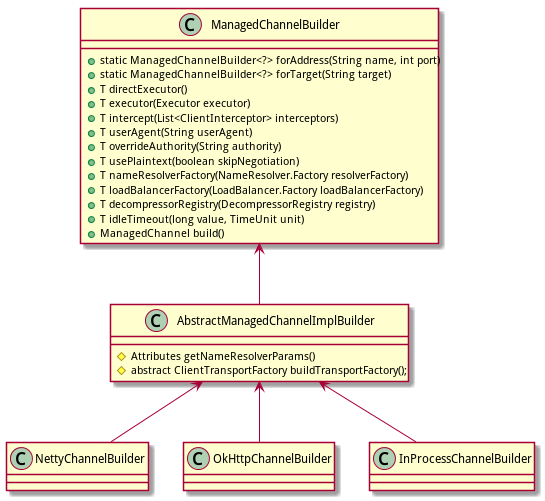

Channel Builder设计与代码实现
===========================

## 功能

Channel Builder 用于帮助创建 Channel 对象。

## 使用场景

标准的实现方式是:

```java
NettyChannelBuilder builder = NettyChannelBuilder.forAddress("127.0.0.1", 1080);
builder.someMethod()......
ManagedChannel channel = builder.build();
```

## 继承结构

Channel Builder 的继承结构如下：



Channel Builder 有三个实现，对应于 netty/okjava/inprocess 三种主要的 Channel 。