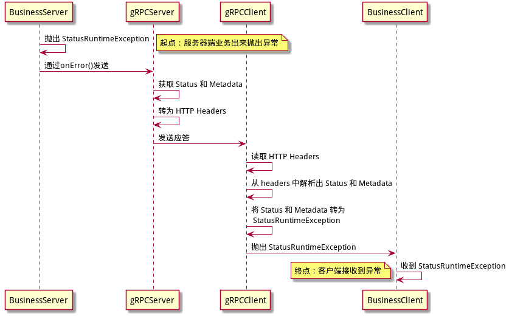
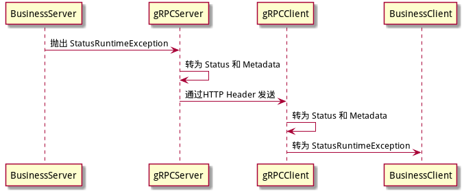

# 异常处理的流程分析

## 前言

在 gRPC 的新版本(1.0.0-pre2)中，为了方便传递 debug 信息，在 StatusException 和 StatusRuntimeException 中增加了名为 Trailer 的 Metadata。

>注： 在此之前，Status(和Status映射的StatusException)只有两个字段可以传递信息：1. status code 2. status decription 如果需要传递其他信息则无计可施。在引入 Metadata 之后，终于可以通过使用 Metadata (映射到HTTP2 header) 来传递更多信息。

至此，gRPC 中处理异常的设计已经基本成型，其核心设计就是通过 Status 和 Metadata 来传递异常信息，服务器端抛出异常到客户端的过程，实际是对 异常 和 Status/Metadata 的传递和转换的过程：

1. 服务器端抛出异常
2. 异常转为 Status/Metadata
3. Status/Metadata 传递到客户端
4. 客户端将 Status/Metadata 转回异常

而 Status/Metadata 在服务器端和客户端的传输中，是通过 HTTP header 来实现的。

整个异常处理的流程概述如图：



最终实现的目标：当服务器端抛出异常时，客户端就会抛出对应的异常。

下面我们对整个流程做详细的代码分析。

## Metadata 的准备工作

### 异常中引入 Metadata

在 StatusRuntimeException 和 StatusException，增加了一个新的构造函数，可以传入 Metadata 并保存起来，同时提供一个getter 方法用来获取保存的 Metadata ：

```java
private final Metadata trailers;

public StatusRuntimeException(Status status, @Nullable Metadata trailers) {
	super(Status.formatThrowableMessage(status), status.getCause());
	this.status = status;
	this.trailers = trailers;
}

public final Metadata getTrailers() {
	return trailers;
}
```

### Status 中引入 Metadata

看 class Status 的相关代码实现，这里主要是做好在 Status 到 异常 的相互转换过程中处理 Metadata 的准备：

1. 定义了两个 Metadata.Key，分别用于 status 的状态码和消息：

    ```java
    /**
    * 用于绑定状态码到 trailing metadata 的key.
    */
    public static final Metadata.Key<Status> CODE_KEY
      = Metadata.Key.of("grpc-status", new StatusCodeMarshaller());

    /**
    * 绑定状态消息到 trailing metadata 的key.
    */
    @Internal
    public static final Metadata.Key<String> MESSAGE_KEY
      = Metadata.Key.of("grpc-message", STATUS_MESSAGE_MARSHALLER);
    ```

2. 从异常(包括cause 链)的中提取出 error trailers

    ```java
    public static Metadata trailersFromThrowable(Throwable t) {
        Throwable cause = checkNotNull(t, "t");
        while (cause != null) {
          if (cause instanceof StatusException) {
            return ((StatusException) cause).getTrailers();
          } else if (cause instanceof StatusRuntimeException) {
            return ((StatusRuntimeException) cause).getTrailers();
          }
          cause = cause.getCause();
        }
        return null;
    }
    ```

3. 重载两个方法，在从 Status 到 异常 的转变过程中容许加入 Metadata 信息

	```java
    public StatusRuntimeException asRuntimeException(Metadata trailers) {
    	return new StatusRuntimeException(this, trailers);
    }
	public StatusException asException(Metadata trailers) {
    	return new StatusException(this, trailers);
	}
	```

## 服务器端流程

### 以onError()方式发送异常

当服务器端需要抛出异常，尤其是 StatusRuntimeException 和 StatusException 时，正确的姿势是通过 StreamObserver 对象的 onError() 方法发送异常信息到客户端：

```java
public void sayHello(SayHelloRequest request, StreamObserver<SayHelloResponse> responseObserver) {
    responseObserver.onError(new StatusRuntimeException(Status.ALREADY_EXISTS));
}
```

onError()方法在 ServerCalls.ServerCallStreamObserverImpl 中的实现：

```java
public void onError(Throwable t) {
  // 从 Throwable 中获取 Metadata
  Metadata metadata = Status.trailersFromThrowable(t);
  if (metadata == null) {
    // 如果没有找到，即异常中没有设置 Metadata，则只能 new 一个空的 Metadata
    metadata = new Metadata();
  }
  // 将 异常 转为 Status 对象，然后加上 Metadata ，一起发送给客户端
  call.close(Status.fromThrowable(t), metadata);
}
```

call 的 close() 方法在 ServerCallImpl 中的实现：

```java
public void close(Status status, Metadata trailers) {
    checkState(!closeCalled, "call already closed");
    closeCalled = true;
    // 发送给 stream
    stream.close(status, trailers);
}
```

stream 的 close() 方法在 AbstractServerStream 中的实现：

```java
public final void close(Status status, Metadata trailers) {
    Preconditions.checkNotNull(status, "status");
    Preconditions.checkNotNull(trailers, "trailers");
    if (!outboundClosed) {
      outboundClosed = true;
      endOfMessages();
      //将 Status 添加到 Metadata
      addStatusToTrailers(trailers, status);
      //将 Metadata 发送出去，注意此时 Status 是没有发送的，只有 Metadata
      abstractServerStreamSink().writeTrailers(trailers, headersSent);
    }
}

private void addStatusToTrailers(Metadata trailers, Status status) {
	// 安全起见，删除 Metadata 中可能存在的 CODE_KEY 和 MESSAGE_KEY
    trailers.removeAll(Status.CODE_KEY);
    trailers.removeAll(Status.MESSAGE_KEY);
    // 将 status 放置到 Metadata
    trailers.put(Status.CODE_KEY, status);
    if (status.getDescription() != null) {
      // 将 description 放置到 Metadata
      trailers.put(Status.MESSAGE_KEY, status.getDescription());
    }
}
```

writeTrailers() 方法在 NettyServerStream 中的实现：

```java
public void writeTrailers(Metadata trailers, boolean headersSent) {
  Http2Headers http2Trailers = Utils.convertTrailers(trailers, headersSent);
  writeQueue.enqueue(
      new SendResponseHeadersCommand(transportState(), http2Trailers, true), true);
}
```

总结：服务器端抛出异常之后，异常信息被转化为 Status 和 Metedata，然后 Status 也最终被转为 Metedata，最后以 HTTP Header 的方式发送给客户端。

### 直接抛出异常

如果 gRPC 服务器端不是以标准的 onError() 方法发送异常，而是以直接抛出异常的方式结束处理流程，则此时的处理方式有所不同： **Metadata 信息会被忽略，而不是传递给客户端！**

> 注：谨记标准的符合 gRPC 要求的方式是通过 onError() 方法，而不是直接抛异常。

当服务器端抛出异常时， 处理这个异常的代码在 ServerImpl.JumpToApplicationThreadServerStreamListener.halfClosed() 中:

```java
private static class JumpToApplicationThreadServerStreamListener implements ServerStreamListener {
	......
    public void halfClosed() {
      callExecutor.execute(new ContextRunnable(context) {
        @Override
        public void runInContext() {
          try {
            getListener().halfClosed(); //服务器端抛出的异常会在这里跑出来
          } catch (RuntimeException e) {
            // 这里没有从异常中获取 Metadata， 而是 new 了一个新的空的
            internalClose(Status.fromThrowable(e), new Metadata());
            throw e;
          } catch (Throwable t) {
            // 同上
            internalClose(Status.fromThrowable(t), new Metadata());
            throw new RuntimeException(t);
          }
        }
      });
    }
}
```

可以看到此时之前异常带的 metadata 信息是会被一个空的对象替代。

> 注： 关于这个事情，我开始认为是一个实现bug，因此提交了一个 Pull Request 给 gRPC，但是后来 gRPC 的开发人员解释说这个是故意设计的，为的就是要强制服务器端使用 onError() 方法而不是直接抛出异常。详细情况请见 [metadata is lost when server sends StatusRuntimeException](https://github.com/grpc/grpc-java/issues/2189)

### 解决方案

虽然 gRPC 官方推荐用 onError() 处理异常，但是实际上在实践时需要每个业务方法都要来一个大的 try catch 。这使得代码冗余而烦琐。

解决的方式，是自己写一个 ServerInterceptor， 实现一个 `io.grpc.ServerCall.Listener` 来统一处理

```java
class ExceptionInterceptor implements ServerInterceptor {
    public <ReqT, RespT> ServerCall.Listener<ReqT> interceptCall(
            ServerCall<ReqT, RespT> call, Metadata headers,
            ServerCallHandler<ReqT, RespT> next) {
        ServerCall.Listener<ReqT> reqTListener = next.startCall(call, headers);
        return new ExceptionListener(reqTListener, call);
    }
}

class ExceptionListener extends ServerCall.Listener {
	......
    public void onHalfClose() {
        try {
            this.delegate.onHalfClose();
        } catch (Exception t) {
            // 统一处理异常
            ExtendedStatusRuntimeException exception = fromThrowable(t);
            // 调用 call.close() 发送 Status 和 metadata
            // 这个方式和 onError()本质是一样的
            call.close(exception.getStatus(), exception.getTrailers());
        }
    }
}
```

## 客户端流程

### 接收应答读取Header

客户端在发送请求收到应答之后，在 DefaultHttp2FrameReader 中读取 frame，前面讲过异常会以HTTP header的方式发送过来，在客户端反应为客户端收到 Headers Frame：

```java
private void processPayloadState(ChannelHandlerContext ctx, ByteBuf in, Http2FrameListener listener){
    switch (frameType) {
		......
        case HEADERS:
            readHeadersFrame(ctx, payload, listener);
            break;
```

读取出来的应答和 header 内容如下图：


这里可以看到以下内容：

1. HTTP 应答的状态码是200,表示成功，即使 gRPC 服务器端返回异常表示业务处理失败。因此，用 HTTP 状态码来评估服务器是否处理正常是没有意义的。
2. HTTP 应答的 content-type 是 "application/grpc"
3. grpc-status 和 grpc-message 两个 header 对应 Status 对象的 code 和 description
4. 其他的 header 对应 Metadata 中的数据，比如上面的 extended-status 和 is-business-exception

### 转换为 status 和 trailer

之后在 Http2ClientStream 中将 header 转成 trailer (也就是Metadata)：

```java
void transportHeadersReceived(Http2Headers headers, boolean endOfStream) {
    if (endOfStream) {
      transportTrailersReceived(Utils.convertTrailers(headers));
    }
    ......
}
```

然后从 trailer 中获取数据转成 Status 对象：

```java
protected void transportTrailersReceived(Metadata trailers) {
    ......
    // 从 metadata 中获取 Status
    Status status = statusFromTrailers(trailers);
    // 清理不再需要的 header
    stripTransportDetails(trailers);
    // 继续处理
    inboundTrailersReceived(trailers, status);
}

private Status statusFromTrailers(Metadata trailers) {
	// 从 metadata 中的两个 key 获取 Status，注意 message 有可能为空
    Status status = trailers.get(Status.CODE_KEY);
    String message = trailers.get(Status.MESSAGE_KEY);
    if (message != null) {
      status = status.augmentDescription(message);
    }
    return status;
}

private static void stripTransportDetails(Metadata metadata) {
    // 去除传输细节
    // 实际就是删除 http 状态码的 header 和 Status 的两个属性的 header
    // 清理之后剩下的就是服务器端传过来的 medatata
    metadata.removeAll(HTTP2_STATUS);
    metadata.removeAll(Status.CODE_KEY);
    metadata.removeAll(Status.MESSAGE_KEY);
}
```

此时 Status 和 Metadata 已经从 header 中还原出来，和服务器端发送的保持一致，后面就是传速和处理过程。

### 传递 Status 和 Metadata

Status 和 Metadata 被一路传递，在 DelayedStreamListener.closed()方法，调用一个任务，在 run()方法中调用 Listener 的 closed()方法：

```java
@Override
public void closed(final Status status, final Metadata trailers) {
  delayOrExecute(new Runnable() {
    @Override
    public void run() {
      realListener.closed(status, trailers);
    }
  });
}
```

ClientCallImpl.ClientStreamListenerImpl，在closed()方法中创建了一个 StreamClosed 的任务，扔给callExecutor：

```java
public void closed(Status status, Metadata trailers) {
	  ......
      final Status savedStatus = status;
      final Metadata savedTrailers = trailers;
      class StreamClosed extends ContextRunnable {
        StreamClosed() {
          super(context);
        }

        @Override
        public final void runInContext() {
          if (closed) {
            // We intentionally don't keep the status or metadata from the server.
            return;
          }
          close(savedStatus, savedTrailers);
        }
      }

      callExecutor.execute(new StreamClosed());
    }
```

这个任务在执行时调用 ClientCallImpl 的 close() 方法，然后调用 observer.onClose() 方法：

```java
private void close(Status status, Metadata trailers) {
  closed = true;
  cancelListenersShouldBeRemoved = true;
  try {
    observer.onClose(status, trailers);
  } finally {
    removeContextListenerAndCancelDeadlineFuture();
  }
}
```

### 将 Status 和 Metadata 转换为异常

最后进入 ClientCalls.UnaryStreamToFuture 的 onClose() 方法，这里做最终的 Status 和异常 的转换:

```java
private static class UnaryStreamToFuture<RespT> extends ClientCall.Listener<RespT> {
	......
    public void onClose(Status status, Metadata trailers) {
      if (status.isOk()) {
		......
      } else {
        // 当 Status 不是OK时，将 Status 和 Metadata 转为异常
        // 然后交给 responseFuture，后面客户端调用就会通过 responseFuture 得到这个异常
        responseFuture.setException(status.asRuntimeException(trailers));
      }
    }
......
}
```

## 总结

整个异常处理的流程，总结起来就是两点：

1. 异常的传输是通过 Status/Metadata 来实现
2. Status/Metadata 的传输是通过 HTTP Header 来实现的

简化之后的流程图：



